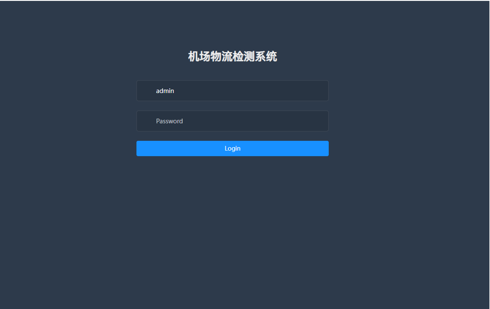
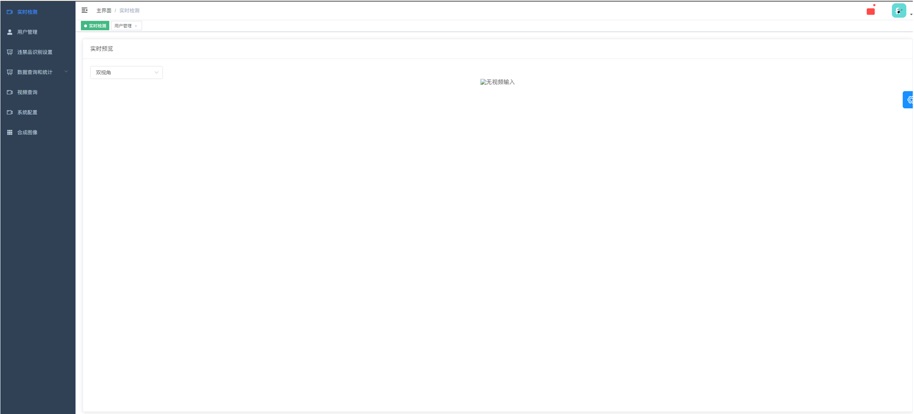
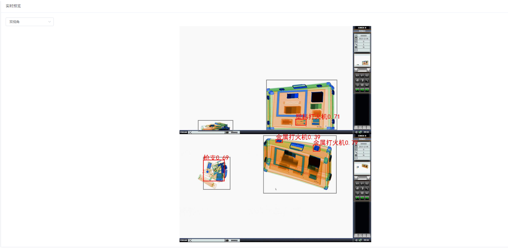
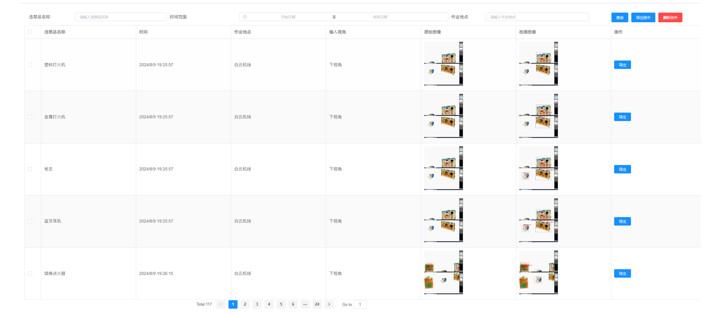
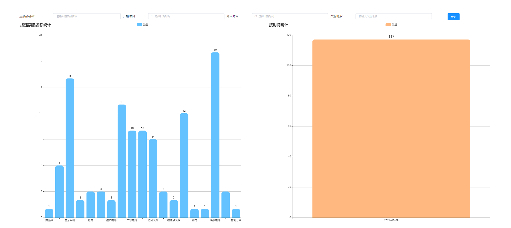
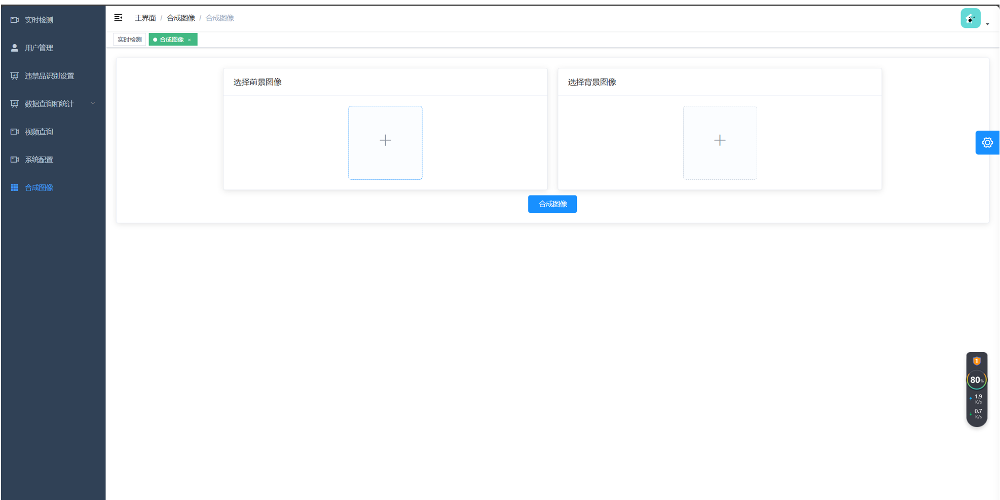

# AirportDetection
因为涉及甲方公司利益，该仓库只作为效果展示，不提供代码。

## 效果展示

### 登陆界面

### 项目主界面

### 实时视频播放界面
前端选择展示的视角，可选择上视角、下视角和双视角展示，通过读取货机传输过来的视频流数据，首先用YOlOV8算法检测出行李箱物体，截取物体到检测算法当中进行违禁品检测，再返回数据。

### 危险品查询统计界面
数据查询页面：点击进去自动获取相关违禁品数据，列出的有违禁品名称、时间、作业地点、输入视角、原始图像、检测图像和操作。点击图像能够放大图像查看。
数据统计：根据违禁品名称统计，根据时间统计数量。

### 危险品合成算法页面
合成图像：该模块可以传如背景及前景图片，预显示选择的前景和背景图像，图像右上角有删除按钮删除图像 有合成图像按钮起码有一个前景图和背景图

